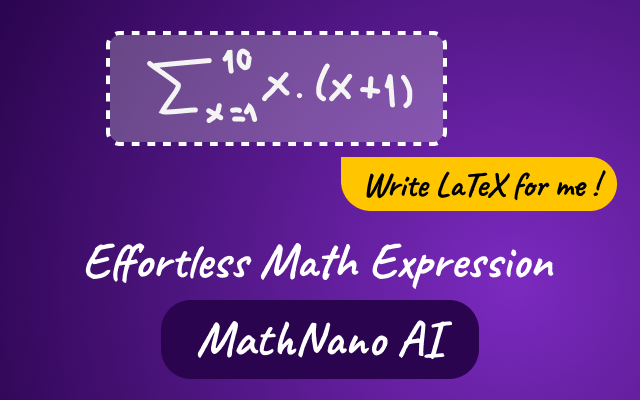

# MathNano AI

> Your AI assistant for effortless math expression.

MathNano AI is a Chrome extension that uses the built-in Chrome AI (Gemini Nano) to provide a powerful, multi-modal interface for creating, extracting, and editing mathematical expressions.

It's a complete LaTeX scratchpad, allowing you to generate complex equations from handwriting, screenshots, speech, or natural language, and then instantly preview and export them as high-quality images.

## 🌟 Features

MathNano AI integrates directly into your browser's side panel, giving you instant access to a suite of AI-powered tools.

* **Multi-Modal AI Input:**
    * **✍️ Handwrite:** Open a canvas, draw your equation, and let the AI convert your handwriting directly into LaTeX.
    * **✂️ Screenshot:** Activate the crop tool, select any equation on any webpage, and the AI will extract the corresponding LaTeX.
    * **🗣️ Speech:** Record yourself speaking an equation (e.g., "x equals minus b plus or minus..."), and the AI will transcribe it into a LaTeX string.
    * **💬 Intelligent Ask:** Type a request in plain English (e.g., "quadratic formula" or "sigmoid function"), and the AI will generate the correct LaTeX for you.

* **Live LaTeX Editor & Preview:**
    * A central text area allows you to type LaTeX manually or edit the AI-generated results.
    * See your equation rendered in real-time in a live preview panel powered by MathJax.

* **Customizable Image Export:**
    * **Copy Image:** Instantly copy the rendered equation as a high-quality PNG to your clipboard.
    * **Download Image:** Save the equation as a PNG file.
    * **Image Settings:** A dedicated settings modal lets you control the final image's **padding**, **scale**, **font color**, **background color**, and **transparency**.

* **On-Device & Private:**
    * This extension leverages the built-in **Chrome AI `LanguageModel` API** (Project Gemini Nano).
    * All AI processing happens **100% on-device**. Your data, drawings, and voice never leave your machine, ensuring complete privacy.
    * A status indicator in the side panel shows whether the local model is available and enabled on your browser.

## 🚀 How it Works

1.  Click the extension icon in your Chrome toolbar to open the MathNano AI side panel.
2.  Use one of the four AI input buttons (Handwrite, Screenshot, Speech, Ask) or type LaTeX directly into the input box.
3.  The AI processes your input locally and inserts the resulting LaTeX code into the editor.
4.  The MathJax panel instantly renders a beautiful preview of your equation.
5.  Click **"Copy Image"** or **"Download"** to export your equation, customized with your saved settings.

## 🔧 Prerequisites & Setup

This extension is built on cutting-edge, on-device AI technology that is not enabled in all Chrome versions by default, Read more [here](https://developer.chrome.com/docs/ai/get-started).

1.  **Supported Browser:** You must be using a version of Google Chrome that includes the `LanguageModel` API.
2.  **Enable AI Flags:** You may need to manually enable the on-device model.
    * Go to `chrome://flags/#prompt-api-for-gemini-nano-multimodal-input`.
    * Select **Enabled** from the dropdown.
    * Relaunch your browser.
3.  **Check Status:** Open the MathNano AI side panel. The status indicator at the top should turn **green** and read **"Local model enabled"**. If it is red, the AI features will be disabled.

